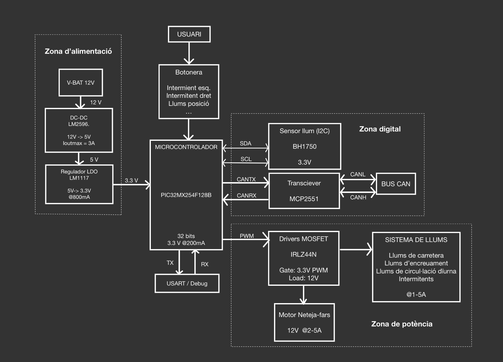

View this project on [CADLAB.io](https://cadlab.io/project/30200). 

# Projecte LLUMS

>**Autors:** 
>Martina Camprubí i Clara Rosaura

----------

## Objectiu

>PCB per control·lar les llums d'un vehicle a través d'un microcontrolador i comunicació CAN. 

## Diagrama de blocs

>

### Descripció/funcionalitat de cada bloc

  * ZONA D'ALIMENTACIÓ:  
	V-BAT 12V: Entrada de tensió provinent de la bateria del vehicle.  
	DC-DC LM2596: Converteix els 12V a 5V.  
	LDO LM1117: Redueix els 5V a 3.3V per alimentar la lògica digital.  
  * CONTROL PRINCIPAL:  
	MICROCONTROLADOR: Processa entrades i controla sortides del Sistema.  
	BOTONERA: Permet a l'usuari seleccionar les diferents funcions de llum i motor.  
	USART / DEBUG: Interfície per comunicació i depuració del Sistema.  
  * ZONA DIGITAL:  
	SENSOR DE LLUM (BH1750): Mesura la llum ambiental via I2C per automatizar funcions.   
	TRANSCEIVER CAN (MCP2551): Adapta els senyals del micro al bus CAN del vehicle.  
	BUS CAN: Xarxa de comuniació amb altres sistemes del vehicle.  
  * ZONA DE POTÈNCIA:  
	DRIVERS MOSFET (IRLZ44N): Actuen com interruptors per controlar càrregues de 12V.  
	SISTEMA DE LLUMS: Conjunt de llums del vehicle controlades electrònicament.  
	MOTOR NETEJA-FARS: Actuador de 12V per al sistema de neteja de fars.  

-----------

## Requisits / Especificacions

  * Alimentació; 12V, regulada 5V
  * Microcontrolador PIC18xxxxxxxxx
  * ...

-----------

## Components

| Descripci&#243; | Ref | Package |Datasheet | Prove&#239;dor | Preu | Unitats |
| --- | --- | --- | --- | ---| --- | --- |
| Microcontrolador | PIC18F26Q83-I/SS | SOIC-28 |[Datasheet](https://www.mouser.es/datasheet/2/268/PIC18F27_47_57Q83_Preliminary_Data_Sheet_40002265B-2887591.pdf) | [Mouser](https://www.mouser.es/c/?q=PIC18F27Q83-I%2FSO)| 2,17&euro;| 1x |
| XTAL-Ressonador | CSTCR7M99G53-R0 | SMD |[Datasheet](https://www.mouser.es/datasheet/2/281/p16e-522700.pdf) | [Mouser](https://www.mouser.es/ProductDetail/Murata-Electronics/CSTCR7M99G53-R0?qs=Zd9RUO93%2Fo7cnwzsujIkpA%3D%3D)  | 0,27&euro; | 1x |

-----------

## Software

### Eines:

  * KiCad 9.0 o superior
  * 

### Configuraci&#243; :

  * 

### Funcionalitats:

  * 

-----------

## Historial de canvis

| Data | Autor     | Branch | Versi&#243; | Descripci&#243; |
| --- | --- | --- | --- | --- |
|  28/03/2023 | mlopez | Master | initial commit | Primera versi&#243; d'esquem&#224;tic i selecci&#243; de components |
